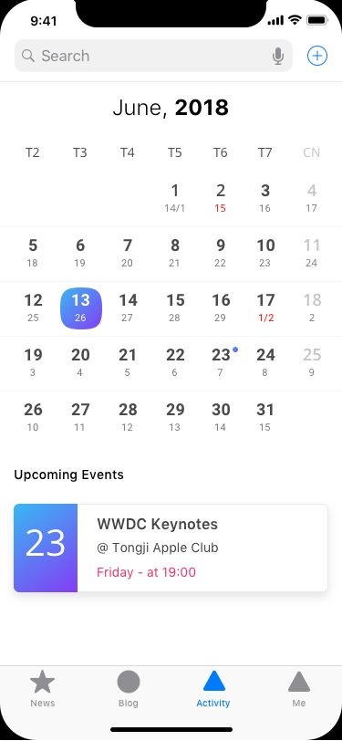
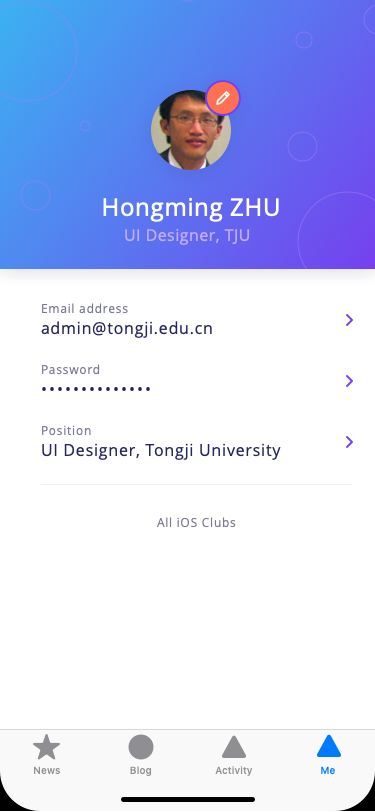
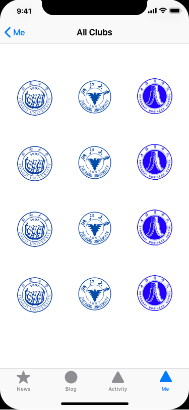
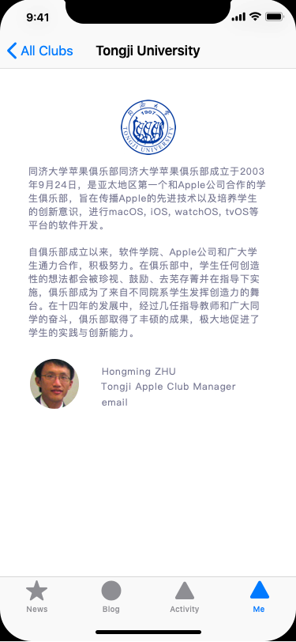

# iOS Club App

### Prototype Info

包含 News, Blog, Activity and Me 四个界面.

基本的权限管理: 访客, 外校club成员, 本校club成员, 本校club主席, admin

#### News

此页主要包含基本的通知和新闻, admin对此页有审核权限, 可以进行删帖和封账号功能(点击新闻右侧的三个点按钮), 新闻的发布者也具有删除权限, 每一条新闻/通知支持图片、文字、视频和调查问卷(调查问卷目前可以仅支持网页链接, 包括问卷星或者.apple的问卷). club成员可以点击问卷跳转webview进行填写.

目前仅有管理员和主席能够添加新闻.

添加页面中对文字、图片、视频和问卷的支持不冲突. 添加完了暂时不考虑审核. 

新闻具有标签, 之后的版本可以支持内容搜索和标签筛选.

新闻的发布和编辑 可以通过点击右上角的 + 进行发布. 可以自由套用轮子等.

新闻发布需要指定可读的权限, 比如仅限本俱乐部和admin或者是全国所有的俱乐部成员.

#### Blog

此页面与News较为相似, 可以分享博客的链接, 点击后通过webview进行浏览.(第一个版本可以仅支持链接的分享, 后续考虑加入blog的写作, 具体分享通过Safari 的 more -> extension实现)

#### Activity

活动界面包括按照日历排列的基本club活动.

活动同样只支持主席和admin进行添加, 没有审核, 能删除, 能搜索.

#### Me

用户的注册可以暂时先俱乐部添加后台进行.

基本的个人信息界面. 可以进行修改密码和个人基本信息. 点击 all ios club 跳转至下一界面.

具体的俱乐部页面下, 可以看到俱乐部简介, 俱乐部成员和管理老师的联系方式.

